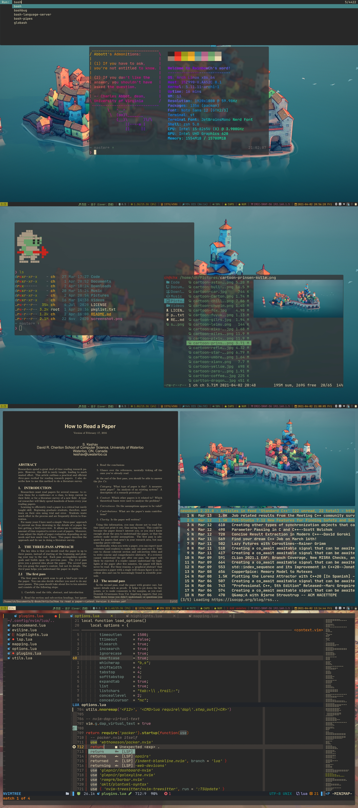

<div align="center">
    <h1>RainbowCh's Dotfiles🍚</h1>
</div>




## Details

- 💻OS: Arch Linux x86_64
- 🐚Shell: zsh
- 🪟WM: i3
- 💿Terminal: [st](https://www.github.com/rainbowhxch/st)
- 💈Status bar: [i3blocks](https://github.com/vivien/i3blocks) and polybar (theme from [here](https://github.com/adi1090x/polybar-themes))
- 🍇Colorscheme: gruvbox
- 🎨GTK theme: Arc [GTK2/3]
- 📺GTK icons: Papirus [GTK2/3]
- ⛲System Font: Noto Sans
- 🍵Terminal Font: JetBrains Mono (Nerd Patched)
- 📔Notification: dunst
- 🍠RSS: newsboat
- 🌸Compositor: [picom(ibhagwan forked)](https://github.com/yshui/picom)
- 🆎Editor: [NeoVim](https:github.com/rainbowhxch/nvim)
- 📁File browser: ranger
- 🏃Runner: [customized dmenu](https://github.com/rainbowhxch/dmenu)
- 🖼Picture Viewer: sxiv
- 🐼PDF Viewer: zathura

## How to use

### Just use it

Run commands:
```bash
cd ~
git clone https://www.github.com/rainbowhxch/dotfiles.git
mv .config .config.bak
mv dotfiles .config
```

### From 0 to 1

Please check my auto-rice bootstrapping script -- [rainbowhxch's LARBS](https://github.com/rainbowhxch/LARBS).

## License
GPL-3.0
