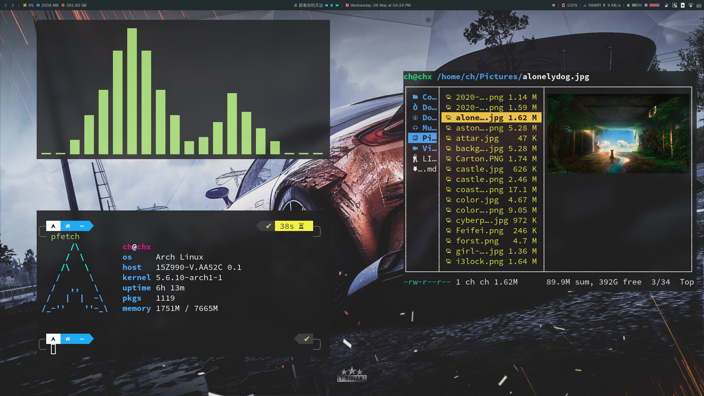

<div align="center">
    <h1>RainbowCh's Dotfiles</h1>
</div>



## Details

- OS: Arch Linux x86_64
- Shell: zsh
- WM: i3
- Terminal: [st](https://www.github.com/rainbowhxch/st)
- Status bar: polybar (theme from [here](https://github.com/adi1090x/polybar-themes))
- Theme: Arc [GTK2/3]
- Icons: Papirus [GTK2/3]
- System Font: Noto Sans
- Terminal Font: Droid Sans Mono (Nerd Patched)
- Runner: [customized dmenu](https://github.com/rainbowhxch/dmenu)

## How to use

### Just use it

Run commands:
```bash
cd ~
git clone https://www.github.com/rainbowhxch/dotfiles.git
mv .config .config.bak
mv dotfiles .config
```

### From 0 to 1

Please check my auto-rice bootstrapping script -- [RainbowCh's LARBS](https://github.com/rainbowhxch/LARBS).

## License
GPL-3.0
